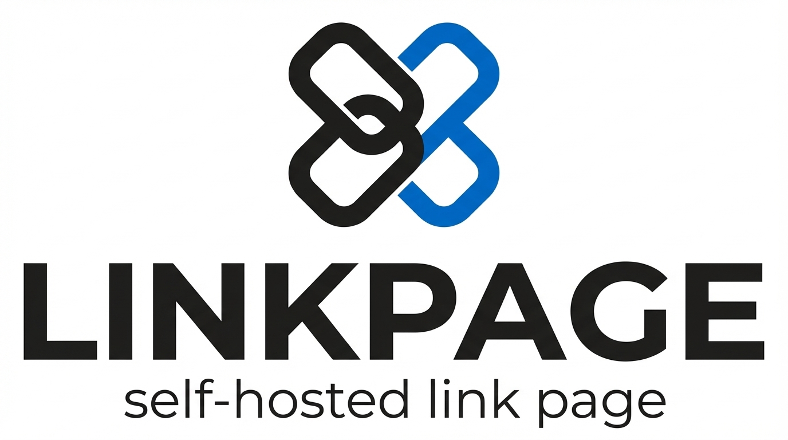
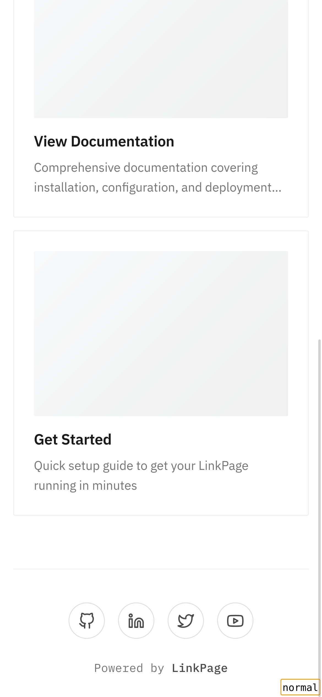

<p align="center">
  
</p>

<p align="center">
  <a href="https://zerodha.tech"></a>
</p>

# LinkPage

A beautiful, self-hosted link-in-bio page built with Go. A FOSS alternative to LinkTree, Linktree, and Campsite.bio with a focus on simplicity, performance, and design.

## Features

- **Beautiful Editorial Design** - Professional, magazine-inspired aesthetic with clean typography
- **Self-Hosted & Open Source** - Own your data, customize everything
- **Fully Responsive** - Looks great on all devices from mobile to desktop
- **Lightning Fast** - Minimal JavaScript, cached Go templates, optimized performance
- **Smart Admin Panel** - Intuitive card-based interface with drag-to-reorder links
- **Auto-Fetch Metadata** - Automatically grab titles, descriptions, and images from URLs using OpenGraph
- **Click Analytics** - Track link performance with anonymized click statistics
- **Basic Auth Protected** - Secure admin endpoints out of the box
- **Social Icons** - Integrated social media links with beautiful icons
- **Simple SQLite Setup** - No complex database configuration required
- **Customizable** - Add custom CSS and branding to match your style

## Screenshots

### Home Page - Desktop


### Home Page - Mobile
<p float="left">
  
  
</p>

*Clean, editorial design with beautiful typography and smooth animations. Fully responsive across all devices.*

### Admin Panel


*Intuitive admin interface with link management, click tracking, and metadata fetching*

## Quick Start

### Using Pre-built Binary

1. **Download** the latest release from [releases page](https://github.com/rhnvrm/linkpage/releases)
2. **Extract** the archive
3. **Initialize** the database and config:
   ```bash
   ./linkpage --init
   ```
4. **Run** the application:
   ```bash
   ./linkpage
   ```
5. **Access** your LinkPage at `http://localhost:8000`
6. **Login** to admin panel at `http://localhost:8000/admin`
   - Default credentials: `username` / `password`
   - **Important:** Change these immediately in `config.toml`

### Using Docker

Initialize the config and database:
```bash
docker run -v linkpage:/linkpage -p 8000:8000 rhnvrm/linkpage:latest ./linkpage --init
```

Run the application:
```bash
docker run -v linkpage:/linkpage -p 8000:8000 rhnvrm/linkpage:latest ./linkpage
```

Your LinkPage will be available at `http://localhost:8000`

### Configuration

Edit `config.toml` to customize:

```toml
# Server settings
http_address = "0.0.0.0:8000"

# Page content
page_title = "Your Name"
page_intro = "Your tagline or bio"
page_logo_url = "/static/app/img/logos/logo-icon-only.png"

# Authentication
[auth]
username = "your-username"
password = "your-secure-password"

# Social links
[social]
github = "https://github.com/yourusername"
twitter = "https://x.com/yourusername"
linkedin = "https://linkedin.com/in/yourusername"
```

## Development Setup

### Prerequisites
- Go 1.19 or higher
- SQLite3

### Steps

1. **Clone the repository**
   ```bash
   git clone https://github.com/rhnvrm/linkpage.git
   cd linkpage
   ```

2. **Initialize the database**
   ```bash
   sqlite3 app.db < schema.sql
   ```

3. **Copy and edit the config**
   ```bash
   cp config.sample.toml config.toml
   # Edit config.toml with your preferred editor
   ```

4. **Run the application**
   ```bash
   go run .
   ```

5. **Access the admin panel**
   - Navigate to `http://localhost:8000/admin`
   - Add your links and customize your page

### Building from Source

```bash
go build -o linkpage.bin
./linkpage.bin
```

## Websites Using LinkPage

- [links.zrd.sh](https://links.zrd.sh) - Zerodha Tech Links

*Using LinkPage? [Submit a PR](https://github.com/rhnvrm/linkpage/pulls) to add your site!*

## Contributing

Contributions are welcome! Please feel free to submit a Pull Request. For major changes, please open an issue first to discuss what you would like to change.

## License

This project is licensed under the MIT License - see the [LICENSE](LICENSE) file for details.

## Acknowledgments

Built by [Rohan Verma](https://rohanverma.net) at [Zerodha Tech](https://zerodha.tech)

---

<p align="center">
  <sub>If you find LinkPage useful, please consider giving it a star on GitHub!</sub>
</p>
