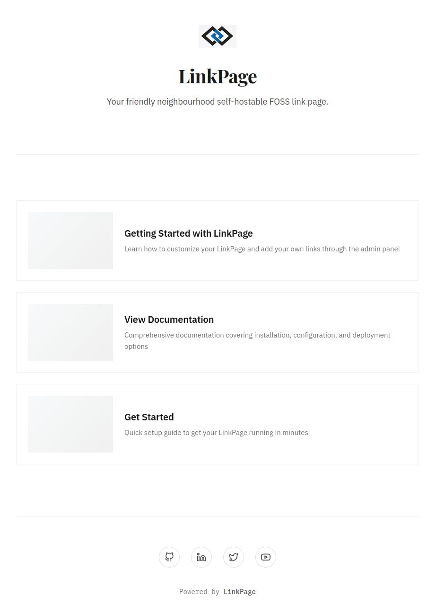
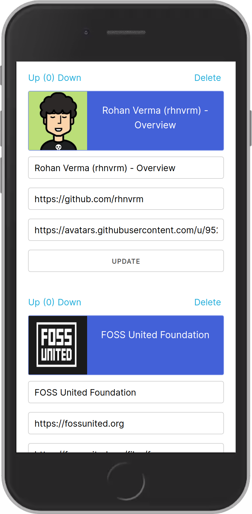

# LinkPage [](https://zerodha.tech)

LinkPage is a FOSS self-hosted alternative to link listing websites such as LinkTree and Campsite.bio

## Features

- Self hostable and open source
- Responsive and customizable design
- Admin panel with custom link ordering
- Fetch details (thumbnail, description) directly from the link using OpenGraph tags
- Minimal JavaScript with cached Go templating for the homepage
- Anonymized link click tracking
- Simple sqlite3 setup for getting started instantly
- Basic Auth for admin endpoints

## Demo

### Home



### Admin



## Get Started

1. Download the latest release
2. Decompress the archive
3. Create a sqlite db with the schema using `sqlite3 linkpage.db < schema.sql`
4. Copy the [config file](config.toml) and update it with your settings
5. Run the app using `./linkpage`

## Developer Setup

0. `git clone https://github.com/rhnvrm/linkpage.git`

1. Initialize SQL schema from `schema.sql` by copying the schema using sqlite:

```
sqlite3 app.db

sqlite> (paste and run schema)
```

2. Edit `config.toml`

3. Run the app

`go run main.go`

4. Insert new entries under `/admin` page.
