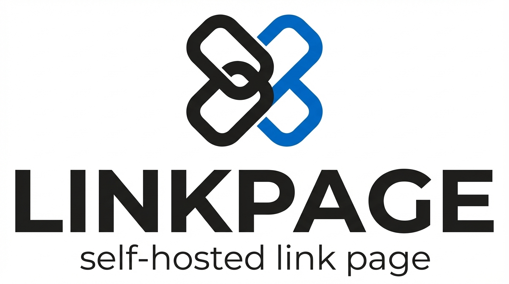
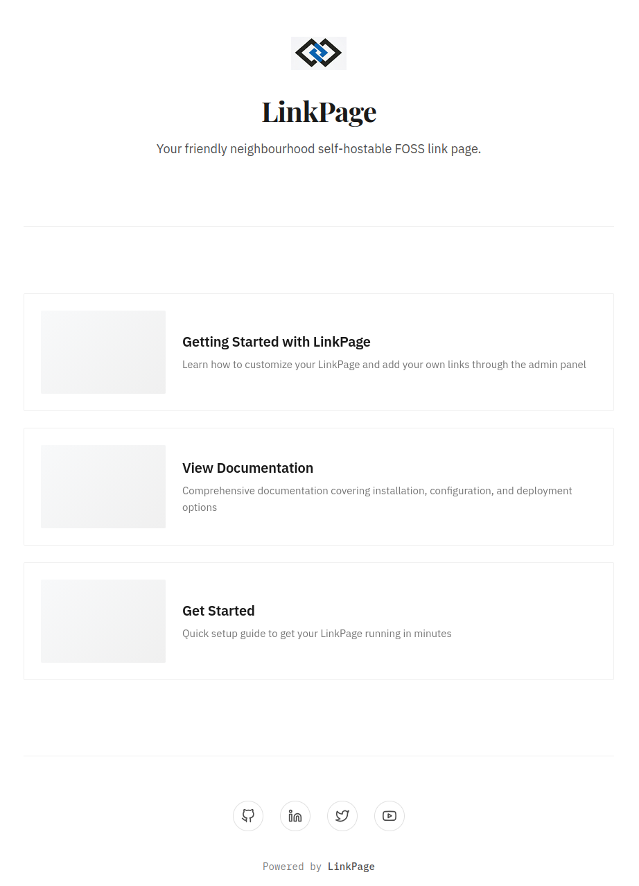
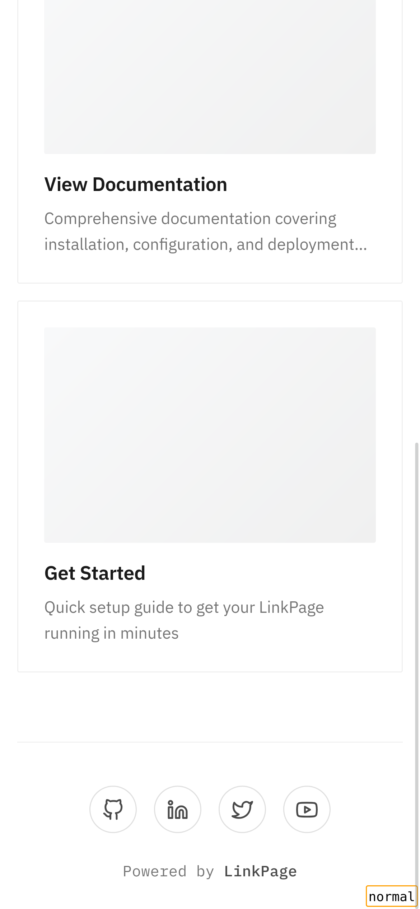
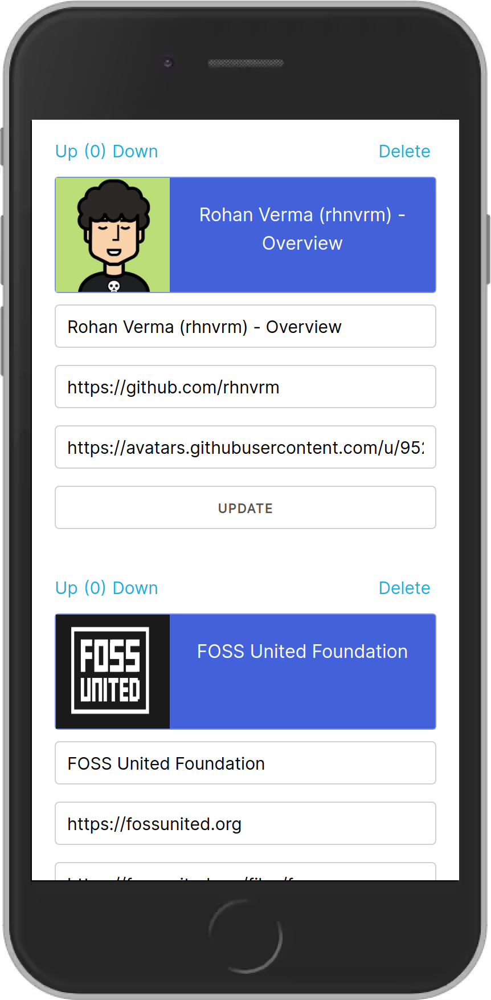

<p align="center">
  
</p>

<p align="center">
  <a href="https://zerodha.tech"></a>
</p>

# LinkPage

A beautiful, self-hosted link-in-bio page built with Go. A FOSS alternative to LinkTree, Linktree, and Campsite.bio with a focus on simplicity, performance, and design.

## Features

- **Beautiful Editorial Design** - Professional, magazine-inspired aesthetic with clean typography
- **Self-Hosted & Open Source** - Own your data, customize everything
- **Fully Responsive** - Looks great on all devices from mobile to desktop
- **Lightning Fast** - Minimal JavaScript, cached Go templates, optimized performance
- **Smart Admin Panel** - Intuitive card-based interface with drag-to-reorder links
- **Auto-Fetch Metadata** - Automatically grab titles, descriptions, and images from URLs using OpenGraph
- **Click Analytics** - Track link performance with anonymized click statistics
- **Basic Auth Protected** - Secure admin endpoints out of the box
- **Social Icons** - Integrated social media links with beautiful icons
- **Simple SQLite Setup** - No complex database configuration required
- **Declarative Mode** - Define links in a TOML seed file; DB becomes a cache of config
- **Nix Flake** - Build with `nix build`, deploy with NixOS module
- **Customizable** - Add custom CSS and branding to match your style

## Screenshots

### Home Page - Desktop


### Home Page - Mobile
<p float="left">
  
  
</p>

*Clean, editorial design with beautiful typography and smooth animations. Fully responsive across all devices.*

### Admin Panel


*Intuitive admin interface with link management, click tracking, and metadata fetching*

## Quick Start

### Using Pre-built Binary

1. **Download** the latest release from [releases page](https://github.com/rhnvrm/linkpage/releases)
2. **Extract** the archive
3. **Initialize** the database and config:
   ```bash
   ./linkpage --init
   ```
4. **Run** the application:
   ```bash
   ./linkpage
   ```
5. **Access** your LinkPage at `http://localhost:8000`
6. **Login** to admin panel at `http://localhost:8000/admin`
   - Default credentials: `username` / `password`
   - **Important:** Change these immediately in `config.toml`

### Using Docker

Initialize the config and database:
```bash
docker run -v linkpage:/linkpage -p 8000:8000 rhnvrm/linkpage:latest ./linkpage --init
```

Run the application:
```bash
docker run -v linkpage:/linkpage -p 8000:8000 rhnvrm/linkpage:latest ./linkpage
```

Your LinkPage will be available at `http://localhost:8000`

### Using Nix

```bash
# Build
nix build github:rhnvrm/linkpage

# Run
./result/bin/linkpage --config config.toml

# Run with declarative seed file
./result/bin/linkpage --config config.toml --seed seed.toml
```

### Configuration

Edit `config.toml` to customize:

```toml
# Server settings
http_address = "0.0.0.0:8000"

# Page content
page_title = "Your Name"
page_intro = "Your tagline or bio"
page_logo_url = "/static/app/img/logos/logo-icon-only.png"

# Authentication
[auth]
username = "your-username"
password = "your-secure-password"

# Social links
[social]
github = "https://github.com/yourusername"
twitter = "https://x.com/yourusername"
linkedin = "https://linkedin.com/in/yourusername"
```

### Declarative Seed Mode

Use `--seed <file.toml>` to manage links declaratively. On every startup, LinkPage clears the database and inserts links from the seed file. This makes the DB a cache of your config — perfect for infrastructure-as-code deployments.

```toml
# seed.toml
[[links]]
url = "https://rohanverma.net"
message = "Personal Website"
description = "Blog, projects, and digital garden"
image_url = ""
weight = 100

[[links]]
url = "https://github.com/rhnvrm"
message = "GitHub"
description = "Open source projects"
image_url = ""
weight = 90
```

The admin panel still works — but in seed mode, any manual changes will be overwritten on the next restart.

### NixOS Module

The flake exports a NixOS module for declarative multi-instance deployment:

```nix
# flake.nix inputs
inputs.linkpage.url = "github:rhnvrm/linkpage";

# configuration.nix
{ inputs, ... }:
{
  imports = [ inputs.linkpage.nixosModules.default ];

  services.linkpage.instances.mylinks = {
    enable = true;
    port = 8001;
    pageTitle = "Your Name";
    pageIntro = "Your tagline";
    social = {
      github = "https://github.com/yourusername";
      twitter = "https://x.com/yourusername";
    };
    links = [
      { url = "https://example.com"; message = "My Website"; description = "Personal site"; weight = 100; }
      { url = "https://github.com/you"; message = "GitHub"; weight = 90; }
    ];
    auth = {
      username = "admin";
      password = "changeme";
    };
  };
}
```

Each instance gets its own systemd service, state directory (`/var/lib/linkpage-<name>/`), and generated config.

## Development Setup

### Prerequisites
- Go 1.21 or higher (uses `modernc.org/sqlite`, no CGO needed)

### Steps

1. **Clone the repository**
   ```bash
   git clone https://github.com/rhnvrm/linkpage.git
   cd linkpage
   ```

2. **Copy and edit the config**
   ```bash
   cp config.sample.toml config.toml
   # Edit config.toml with your preferred editor
   ```

3. **Run the application**
   ```bash
   go run .
   ```
   The database is created automatically on first run.

4. **Access the admin panel**
   - Navigate to `http://localhost:8000/admin`
   - Add your links and customize your page

### Building from Source

```bash
go build -o linkpage.bin
./linkpage.bin
```

## Websites Using LinkPage

- [links.zrd.sh](https://links.zrd.sh) - Zerodha Links
- [varsity.zrd.sh](https://varsity.zrd.sh/) - Zerodha Varsity Links

*Using LinkPage? [Submit a PR](https://github.com/rhnvrm/linkpage/pulls) to add your site!*

## Contributing

Contributions are welcome! Please feel free to submit a Pull Request. For major changes, please open an issue first to discuss what you would like to change.

## License

This project is licensed under the MIT License - see the [LICENSE](LICENSE) file for details.

## Acknowledgments

Built by [Rohan Verma](https://rohanverma.net) at [Zerodha Tech](https://zerodha.tech)

---

<p align="center">
  <sub>If you find LinkPage useful, please consider giving it a star on GitHub!</sub>
</p>
